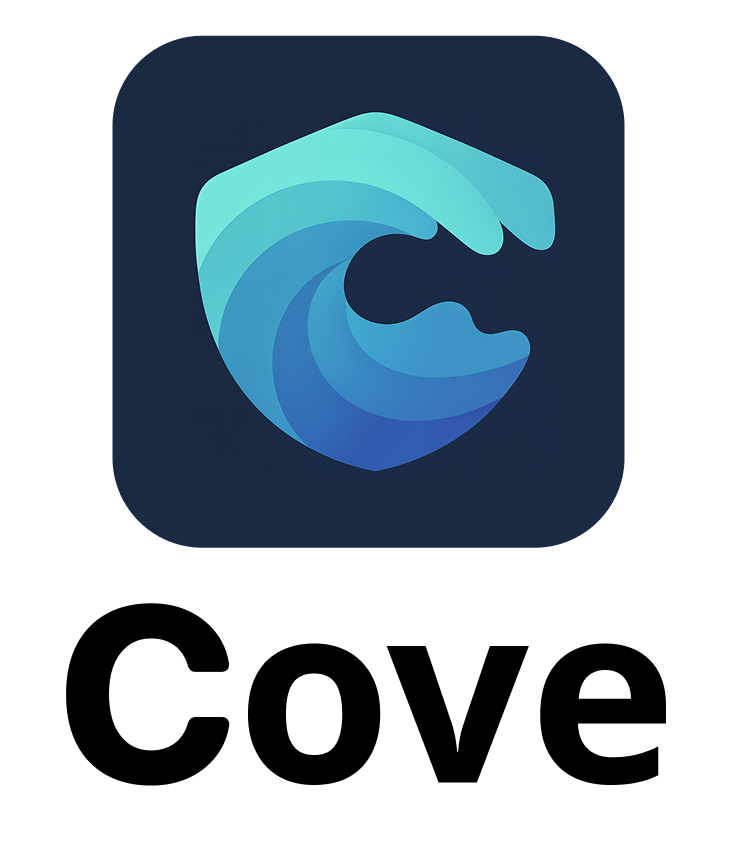

  

## About

Cove is a simple to use yet powerful Bitcoin mobile wallet.
The wallet is built on top of the [BDK](https://bitcoindevkit.org/) library.

We provide hot wallet support but one of the main goals is to be the best mobile wallet to use with hardware wallets.

## Available on The Apple AppStore

## Build from Source

### Requirements

- Xcode 16.0+
- Swift 5.5+
- [Rust](http://rustup.rs)
- [Just](https://github.com/casey/just)

### Setup

1. Clone the repository
2. Build the Rust library and bindings with `just build-ios-debug-device` for a debug build or `just build-ios-release` for a release build.
3. Open `ios/Cove.xcodeproj` in Xcode.
4. Build and run the app.

## Features

- Import hardware wallet (xpub / public descriptor) using NFC, File & QR
- Create hot wallet, and verify hot wallet backup
- Send Bitcoin using a hot wallet
- Send Bitcoin using a hardware wallet, using NFC, File or QR for transferring PSBTs
- View transaction details
- Create and use multiple wallets
- Create and use BIP329 labels
- Import and Export BIP329 labels
- Select your preferred fiat currency
- Connect your own node
- Create Trick Pins (Wipe Data & Decoy PIN)
- Use FaceID or PIN to lock your wallets
- UTXO list and Coin Control (select individual UTXOs to spend)

## Demo Video

https://github.com/user-attachments/assets/9c933b90-a991-4c09-be29-2825d535bc1e

## Coming Soon...

- Lock and Unlock individual UTXOs
- Support for SATSCARD
- Android version

## Acknowledgements

- [OpenSats](https://opensats.org/) for the grant that made it possible for me to dedicate my time to this project.
- [BDK](https://bitcoindevkit.org/) which Cove is built on, thanks for the great work, and for your help along the way.
- [Adrian Lischer](https://x.com/adrianlischer) for the UI designs and UX feedback.
- All the alpha and beta testers that have provided valuable feedback.
- [Craig Raw](https://x.com/craigraw) for helping me make integrations with sparrow work smoothly.
- [Coinkite](http://coinkite.com) for providing me with hardware to test on and helping me with integrations.
- [NVK](http://twitter.com/nvk) for the Cove name and feedback.

## License

Cove is released under the [MIT license](LICENSE).
